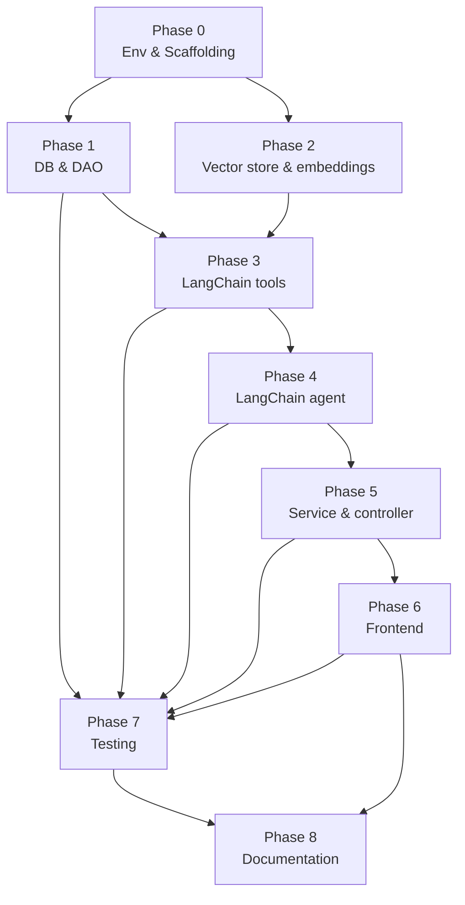

# Implementation Guide — Database Query Assistant (Hackathon, greenfield)

Companion to [`01_business_requirements.md`](./01_business_requirements.md) and
[`04_solution_design.md`](./04_solution_design.md)
(architecture rationale). This guide turns the skeleton in `src/` (see
[`08_project_structure.md`](./08_project_structure.md)) into an ordered set of
implementation phases, so anyone picking this up knows **what to build,
where it goes, in what order, and how to know it's done.**

---

## 1. How to read this guide

Each phase below lists:
- **Covers** — ties back to the plan doc's architecture decisions / the business domain's Workshop Goals
- **Files** — exact paths under `src/`
- **Steps** — concrete implementation checklist
- **Depends on** — phases that must exist first (even as a stub)
- **Done when** — the acceptance check before moving on
- **Reuse** — what carries over near-verbatim from the prior (Workshop 2/3)
  implementation vs. what's genuinely rebuilt for this LangChain-native repo

Phases are numbered in dependency order, but phases with no dependency
between them (e.g. Phase 1 and Phase 2) can run **in parallel** — see the
workflow diagram in §3.

---

## 2. Workshop Goals → Phase mapping

| Workshop Goal | Covered in |
|---|---|
| PostgreSQL Integration | Phase 1 |
| RAG / Vector Database Integration / Embeddings | Phase 2 |
| Function Calling mechanisms (as LangChain tools) | Phase 3 |
| LangChain Integration | Phase 3, Phase 4 |
| Chat Completion endpoints | Phase 4 (agent call), Phase 5 (HTTP endpoint) |
| Multi-turn Chatbot architecture, Conversation Memory Management | Phase 5 |
| Few-shot Prompting, refusal/scope behavior | Phase 4 |
| `source_tables` UI attribution | Phase 3 (mapping), Phase 4 (wiring), Phase 6 (rendering) |

---

## 3. Phases

### Phase 0 — Environment & Scaffolding

- **Covers:** foundation for all goals below
- **Files:** `requirements.txt`, `.env.example`, `src/config/settings.py`, root `README.md`
- **Steps:**
  1. `requirements.txt`: fastapi, uvicorn, streamlit, sqlalchemy, psycopg2-binary, python-dotenv, pydantic, langchain-core, langchain-classic, langchain-openai, langchain-community, faiss-cpu, sentence-transformers, pytest.
  2. `.env.example`: `DATABASE_URL`, `OPENAI_API_KEY`, `OPENAI_BASE_URL`, `OPENAI_MODEL`, `OPENAI_VERIFY_SSL`, `VECTOR_STORE_DIR`, `EMBEDDING_MODEL_NAME`, `BACKEND_URL`.
  3. `settings.py`: load repo-root `.env` via `python-dotenv`, expose typed constants, fail fast if a required var (`DATABASE_URL`, `OPENAI_API_KEY`) is missing.
- **Depends on:** nothing
- **Done when:** `python -c "from src.config.settings import DATABASE_URL, OPENAI_API_KEY"` runs with no error from any teammate's machine (after copying `.env.example` to `.env` and filling in real values).
- **Status:** done.

### Phase 1 — Database & DAO layer

- **Covers:** PostgreSQL Integration
- **Files:** `src/database/scripts/schema.sql`, `src/database/scripts/init_db.py`, `src/database/mock_data/sample_data.sql`, `src/database/dao/*.py`, `src/database/connection/connection_pool.py`
- **Steps:**
  1. Write DDL for `products`, `customers`, `sales`, `regions` (+ FKs, indexes) in `schema.sql` (see `06_database_design.md` for the target ERD).
  2. Write representative `INSERT` statements in `sample_data.sql` matching `01_business_requirements.md`'s example conversation numbers.
  3. `init_db.py`: run `schema.sql` then `sample_data.sql` against Neon, print row counts to verify.
  4. `connection_pool.py`: SQLAlchemy engine + session/context manager reading `DATABASE_URL` from `config.settings`.
  5. `dao/*.py`: one module per table/aggregate area — `product_dao.py`, `customer_dao.py`, `sales_dao.py` (trend/profit/KPI aggregates), `region_dao.py`, `analytics_dao.py`.
- **Depends on:** Phase 0
- **Done when:** `python database/scripts/init_db.py` (from `src/`) completes with non-zero rows in all 4 tables, and each DAO function, called directly in a scratch script, returns rows matching the seeded data.
- **Reuse:** `src/database/` ports near-verbatim from the prior implementation — same schema, same DAO signatures, no LangChain dependency in this layer.
- **Status:** done (requires a real `DATABASE_URL` to run `init_db.py` against; DAO code and SQL are in place and unit-testable once Phase 7 adds a DB fixture).

### Phase 2 — Vector store & embeddings

- **Covers:** RAG / Vector Database Integration / Embeddings
- **Files:** `src/embedding/*.md`, `src/langchain_app/vectorstore/embeddings.py`, `src/langchain_app/vectorstore/store.py`
- **Steps:**
  1. Author knowledge-base docs in `embedding/` (DB schema description, sample SQL queries).
  2. `embeddings.py`: `HuggingFaceEmbeddings` factory using `EMBEDDING_MODEL_NAME` from `config.settings` — single source of truth, no dual embedding-function path.
  3. `store.py`: build a FAISS index from `embedding/` docs, persist to `VECTOR_STORE_DIR`, and expose a `get_retriever()`/similar accessor.
- **Depends on:** Phase 0 only — can run in parallel with Phase 1.
- **Done when:** a scratch script builds the index and a similarity search for a schema-related question returns the relevant `embedding/` doc chunk.
- **Reuse:** the vectorstore mechanism is new (FAISS instead of Chroma — see plan doc's Windows DLL-order rationale). `embedding/db_diagrams.md` and `embedding/sample_sqls.md` were written from scratch to match the actual implemented schema (`unit_price`/`unit_cost`/generated `revenue`/`profit`), not generic placeholder column names.
- **Status:** done.

### Phase 3 — LangChain tools

- **Covers:** Function Calling mechanisms (as LangChain tools)
- **Files:** `src/langchain_app/tools/business_tools.py`, `src/langchain_app/tools/retrieval_tool.py`, `src/langchain_app/table_sources.py`
- **Steps:**
  1. `business_tools.py`: one `@tool`-decorated function per business function (16 total, `parse_docstring=True` so each parameter's description comes from the docstring's `Args:` section), each wrapping a `database.dao` call. Every tool body runs through a `_safe()` helper that catches bad-argument/DB errors and returns `{"error": "..."}` instead of raising.
  2. `retrieval_tool.py`: `@tool`-decorated function wrapping the FAISS retriever from Phase 2's `store.py`, same graceful-error handling.
  3. `table_sources.py`: map each tool name to the DB table(s) it queries, for `source_tables` UI attribution; `get_source_tables_for_steps()` aggregates unique tables across an `AgentExecutor`'s `intermediate_steps` for Phase 4 to call directly.
- **Depends on:** Phase 1 (DAO), Phase 2 (retriever)
- **Done when:** a scratch script invokes each tool directly (bypassing the agent) and gets correct results; `table_sources.get_source_tables()` returns the right table names for a sample set of tool calls.
- **Reuse:** the business logic inside each tool (what each function computes) reuses the prior
  implementation's handler logic almost verbatim — only the wrapping mechanism changes (`@tool`
  instead of a hand-rolled JSON schema + registry/executor).
- **Status:** done. Verified with a mocked-DB smoke test (invalid args and DB-unreachable both
  return graceful `{"error": ...}` results; retrieval tool returns correct chunks; `table_sources`
  mapping and aggregation both correct).
- **Windows gotcha found here:** wiring `business_tools` (eagerly loads SQLAlchemy's compiled
  Cython extensions) and `retrieval_tool` (lazily loads `sentence-transformers`/torch) into the
  same process for the first time surfaced a new DLL load-order conflict — SQLAlchemy's
  cyextensions loading first breaks torch's DLL init (`OSError: [WinError 1114] ... c10.dll ...`),
  the same category of bug as the documented torch-vs-onnxruntime issue, different pairing. Fixed
  in `langchain_app/tools/__init__.py` (forces the embedding model to load first); see that file's
  docstring, `tools/README.md`, and the plan doc's "lessons learned" section.

### Phase 4 — LangChain agent

- **Covers:** LangChain Integration, Chat Completion (agent call), Few-shot Prompting, refusal/scope behavior
- **Files:** `src/langchain_app/llm.py`, `src/langchain_app/prompts.py`, `src/langchain_app/agent.py`
- **Steps:**
  1. `llm.py`: `get_llm()` factory constructing `ChatOpenAI` with gateway `base_url`/`http_client(verify=OPENAI_VERIFY_SSL)` compat and a per-call random `seed` override (`_generate()` override pattern) to defeat the shared gateway's response caching.
  2. `prompts.py`: `ChatPromptTemplate` with scope rules, refusal behavior for out-of-scope questions, and few-shot examples covering both business-tool and retrieval-tool usage.
  3. `agent.py`: `create_tool_calling_agent(llm, tools, prompt)` + `AgentExecutor(..., return_intermediate_steps=True)`; `run_turn()` invokes it and passes `intermediate_steps` through `table_sources.get_source_tables_for_steps()` to produce `source_tables` alongside the answer.
- **Depends on:** Phase 3 (tools)
- **Done when:** the 3-turn example from `01_business_requirements.md > Example Conversation` ("top 5 products by revenue" → "Only in Asia." → "What insights can you provide?") runs correctly end-to-end through `agent.py` in a scratch script (no HTTP/UI needed yet), including non-empty `source_tables` on the data-retrieval turns.
- **Reuse:** none directly — this is the one layer rebuilt LangChain-native rather than ported (see plan doc's "What's rebuilt" section). `prompts.py`'s `SYSTEM_PROMPT`/`INSIGHT_PROMPT`/`RECOMMENDATION_PROMPT` are ported near-verbatim in content from the prior implementation's prompt templates (same scope/refusal rules and few-shot examples — only "functions" → "tools" wording and a new retrieval-tool few-shot example were added).
- **Status:** done. `build_agent_executor()` takes `llm`/`tools` overrides specifically so it can be verified without a real OpenAI-compatible endpoint: tested end-to-end against `langchain_core`'s `FakeMessagesListChatModel` (scripted responses) covering single tool call, multi-tool-call batching in one round, the no-tool-call refusal path (`source_tables == []`), and a multi-turn follow-up via `chat_history`. `llm.py`'s real `_GatewayChatOpenAI` construction was verified separately (config wiring, per-temperature caching) — actual network calls against a real gateway are still untested (no credentials available in this environment) and should be the first thing checked once real `OPENAI_API_KEY`/`OPENAI_BASE_URL` values are available.

### Phase 5 — Service & controller layer

- **Covers:** Multi-turn Chatbot architecture, Conversation Memory Management, HTTP surface
- **Files:** `src/backend/models/{conversation,message}.py`, `src/backend/services/{chat,insight,recommendation}_service.py`, `src/backend/controllers/chat_controller.py`, `src/app.py`
- **Steps:**
  1. `models/`: `Conversation`/`Message` in-memory models (dict keyed by `conversation_id` is sufficient for the workshop).
  2. `chat_service.py`: per-conversation `threading.Lock`, delegates each turn to `langchain_app.agent`, persists the turn (including `source_tables`).
  3. `insight_service.py` / `recommendation_service.py`: call `langchain_app.llm.get_llm()` directly (different prompts) against the last tool-call result — no agent loop needed.
  4. `chat_controller.py`: `POST /api/v1/chat`, `GET /chat/{id}/history`, insight/recommendation/clear endpoints; validate input, map exceptions to HTTP errors.
  5. `app.py`: FastAPI composition root mounting `chat_controller`.
- **Depends on:** Phase 4
- **Done when:** `uvicorn app:app` (from `src/`) runs, and `curl -X POST /api/v1/chat` with a sample question returns the expected JSON (`answer` + `source_tables`).
- **Reuse:** `models/` and the conversation-store/locking pattern in `chat_service.py` port near-verbatim from the prior implementation; only the AI call inside `chat_service` changes — no hand-rolled multi-round tool-calling loop is needed here since `AgentExecutor` already owns that.
- **Status:** done. Verified with FastAPI's `TestClient` against the real `app`, with `chat_service`'s `AgentExecutor` swapped for one built from a scripted fake chat model (same technique as Phase 4) and `insight_service`/`recommendation_service`'s `get_llm` monkeypatched similarly — covering `/health`, `/health/db` (503 on unreachable DB, not a crash), a full chat turn, a follow-up turn via `chat_history`, the "no data yet" insight guard message (TC-06), insight/recommendation reuse of the last tool result (TC-07/TC-08), request validation (TC-05), and conversation clearing (TC-10). No real gateway credentials were available or needed.

### Phase 6 — Frontend

- **Covers:** Web UI (conversational interface), `source_tables` rendering
- **Files:** `src/frontend/app.py`, `api_client.py`, `pages/{home,chat}.py`, `components/{chat_interface,response_display,conversation_history}.py`
- **Steps:**
  1. Port `chat_interface.py`, `conversation_history.py`, `api_client.py`, `pages/*`, `app.py` unmodified — `source_tables` caption rendering was already present in both `chat_interface.render_message_thread()` and `response_display.render_answer()`, so no functional change was needed there.
  2. `api_client.py`: one required adjustment — read `.env` from the repo root (`parent.parent.parent`), not `src/.env`, since this repo's `.env` lives one level up from where the prior implementation's did.
- **Depends on:** Phase 5 for the real integration (UI shell can be ported/tested against a mocked response anytime).
- **Done when:** the full example conversation runs manually in the browser via `streamlit run frontend/app.py` (from `src/`), including a visible `source_tables` caption on data-retrieval answers.
- **Reuse:** `src/frontend/` ports near-verbatim — same chat UI, same logic, to reduce cost.
- **Status:** done. Verified with Streamlit's `AppTest` headless testing framework against a *real* backend (FastAPI `app` run via `uvicorn` in a background thread, with `chat_service`'s `AgentExecutor` swapped for one built from a scripted fake chat model): both pages render with no exceptions, health metrics degrade gracefully when unreachable, clicking a suggested question round-trips through the real HTTP API and persists correctly across the page's own `st.rerun()`, and the `source_tables` caption renders correctly. This also confirmed `api_client.py`'s `trust_env=False` workaround is necessary in this specific environment (system-wide `HTTP_PROXY`/`HTTPS_PROXY` intercepting loopback traffic) — my own test-script HTTP polling hit the exact same issue before I applied the same workaround to it.

### Phase 7 — Testing & mock data

- **Covers:** Testing deliverables
- **Files:** `src/tests/unit/`, `src/tests/integration/`, `src/tests/end_to_end/`
- **Steps:**
  1. Unit tests: DAO functions, `business_tools.py` wrapping, `table_sources.py` mapping.
  2. Integration tests: `TestClient` + `src/dev_fake_backend.py`'s `apply_fakes()` (DAO layer swapped for in-memory data matching the example conversation), full chat turns including a follow-up — reuse `apply_fakes()` directly as a pytest fixture rather than re-deriving the fake dataset.
  3. End-to-end test: replay the example conversation from `01_business_requirements.md` through the live API.
- **Depends on:** the phases each test targets
- **Done when:** `pytest` is green and results are recorded.
- **Status:** `src/dev_fake_backend.py` itself is done and verified (adapted from the prior workshop's dev-only fake-DB script — same fake dataset and DAO-monkeypatch technique, retargeted at `database.dao.*` directly since `business_tools.py` calls those modules directly rather than through a function-calling handler layer). Verified standalone (business tool calls return the exact example-conversation numbers) and through the full HTTP stack (`TestClient` + a scripted fake chat model reproducing the 3-turn example conversation end to end). The `unit`/`integration`/`end_to_end` pytest suite itself is not yet written.

### Phase 8 — Documentation & presentation deliverables

- **Covers:** Documentation and workshop presentation deliverables
- **Files:** `docs/11_api_documentation.md`, `docs/07_database_schema_reference.md`, `docs/09_environment_setup_guide.md`
- **Steps:**
  1. `11_api_documentation.md`: every `chat_controller.py` route, request/response shapes, and error behavior.
  2. `07_database_schema_reference.md`: table/column reference derived from `schema.sql`, key metric formulas, seed data summary.
  3. `09_environment_setup_guide.md`: environment setup end to end, plus a troubleshooting section covering every real issue hit building this (proxy/loopback interception, gateway TLS, response caching, the two Windows DLL-load-order conflicts, and how to test without real LLM/DB credentials).
  4. Root `README.md`: expanded test-cases table (TC-01 through TC-12) reflecting what was actually verified.
  5. Problem statement + mock data schema writeup: already covered by `01_business_requirements.md` (problem statement, inherited unchanged) and `07_database_schema_reference.md` (seed data) — no separate document needed.
  6. Presentation deck: a 20-slide outline was used as a template; filling it in with this repo's actual content, screenshots, and test results is not yet done.
- **Depends on:** phases substantially complete
- **Status:** done (documentation). The presentation deck itself is still open, since it needs screenshots/a demo recording of the running app.

---

## 4. Full workflow (dependency graph)

**Parallel tracks once Phase 0 is done:**
- Track A (data): Phase 1
- Track B (RAG): Phase 2
- Track C (UI shell): Phase 6 can start against a mocked backend response

Track A and B must both finish before Phase 3 (LangChain tools, which need
both the DAO layer and the retriever) can be fully wired, and Phase 4
(agent) needs Phase 3 complete.

---

## 5. Definition of done for the whole system

The system is demo-ready when the 3-turn example conversation in
`01_business_requirements.md > Example Conversation` works unmodified through
the full stack: **Web UI → Controller → Service → LangChain Agent (tools +
retrieval) → DAO / FAISS → Neon PostgreSQL / vector store → back to the
user**, including `source_tables` attribution and the generated business
insight and recommendations on the third turn.
