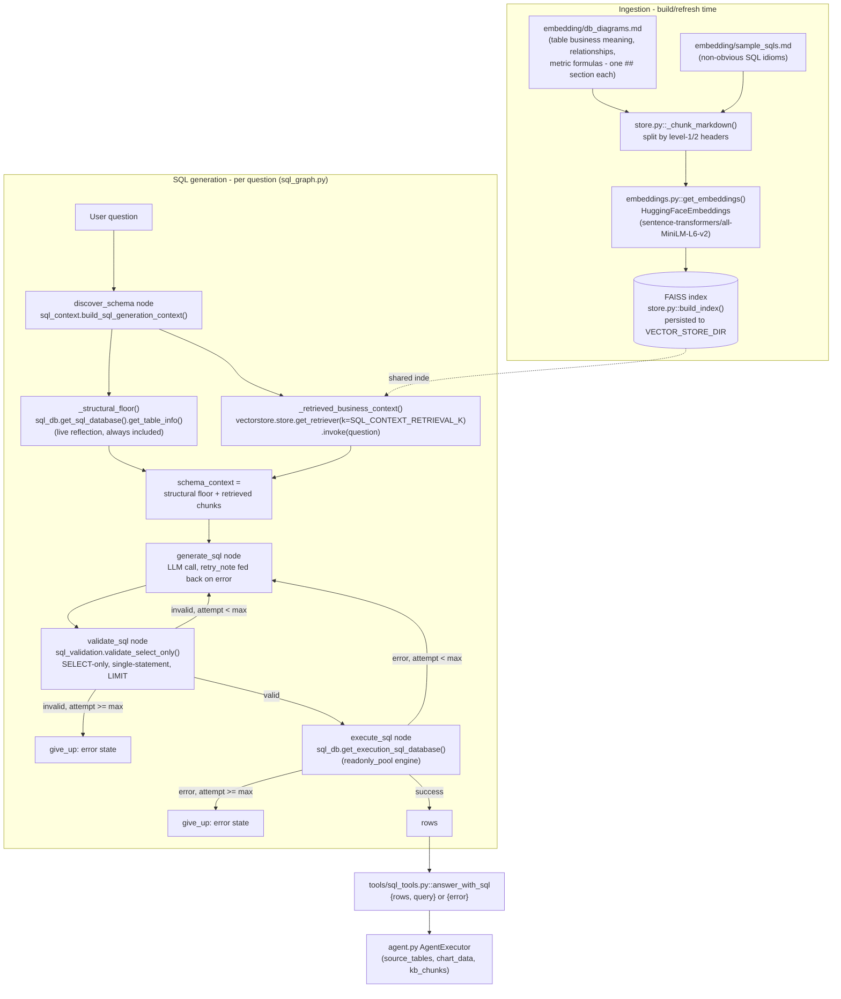

# Embedding-Driven SQL Generation — High-Level Architecture

## 1. High-Level Diagram

Two subsystems, cleanly separated: ingestion runs whenever
`embedding/` docs change (or on first load); generation runs once per
user question, inside the LangGraph state machine `sql_graph.py`
compiles.

---

## 2. Component Map

| Layer | File | Role |
|---|---|---|
| Ingestion source | `src/embedding/db_diagrams.md` | ERD + one `##` section per table (business meaning, relationship semantics) and per metric formula — retrieval-optimized, not just column/type lists |
| Ingestion source | `src/embedding/sample_sqls.md` | Non-obvious SQL idioms only (`NULLIF` guard, `LEFT JOIN` for zero-activity dimensions, `date_trunc` bucketing, `LAG` window function) — narrowed once the SQL agent could write its own SQL |
| Chunking | `src/langchain_app/vectorstore/store.py` (`_chunk_markdown`, `load_documents`) | Splits by `##`/`#` header into one `Document` per topic; hashes source content to detect a stale persisted index |
| Embedding | `src/langchain_app/vectorstore/embeddings.py` (`get_embeddings`) | Single source of truth for the embedding model; reused by both consumers below |
| Vector store | `src/langchain_app/vectorstore/store.py` (`get_vectorstore`, `get_retriever`) | One FAISS index, persisted to `VECTOR_STORE_DIR`, rebuilt automatically when source content hash changes |
| Structural floor | `src/langchain_app/sql_db.py` (`get_sql_database`) | Live `SQLDatabase.get_table_info()` reflection over the 4 domain tables — cheap, always-correct, no business meaning |
| Context builder | `src/langchain_app/sql_context.py` (`build_sql_generation_context`) | Combines the structural floor with per-question retrieved business context — called fresh every turn, not once at import |
| SQL sub-graph | `src/langchain_app/sql_graph.py` (`build_sql_graph`, `run_sql_graph`) | LangGraph state machine: `discover_schema → generate_sql → validate_sql → execute_sql`, with bounded retry back to `generate_sql` on validation/execution failure |
| Safety gate | `src/langchain_app/sql_validation.py` (`validate_select_only`) | Deterministic (non-LLM): single statement, `SELECT`/`WITH` only, no DML/DDL keywords, mandatory `LIMIT` |
| Execution engine | `src/langchain_app/sql_db.py` (`get_execution_sql_database`) | Separate SQLAlchemy engine over `readonly_pool.py`'s restricted role — a validator bug must not be the only thing standing between generated SQL and a write |
| Tool surface | `src/langchain_app/tools/sql_tools.py` (`answer_with_sql`, `sql_db_schema`) | Exposes the graph to the outer tool-calling agent as a natural-language-in, structured-result-out tool |
| Outer agent | `src/langchain_app/agent.py` | Registers `sql_tools` unconditionally, alongside `search_knowledge_base` (also unconditional) and the 16 fixed business tools (gated by `FIXED_TOOLS_ENABLED`) |
| Background Q&A (second consumer of the same index) | `src/langchain_app/tools/retrieval_tool.py` (`search_knowledge_base`) | Same FAISS index, `k=3`, for prose schema/SQL questions — not part of SQL generation, but shares the ingestion pipeline above |

---

## 3. Ingestion Pipeline (build/refresh time)

1. `store.load_documents()` reads every `.md`/`.txt`/`.sql` file under
   `embedding/` (excluding `README.md`) and splits each on `_HEADER_SPLIT_RE`
   (`\n(?=##?\s+)`) — one chunk per `##`/`#` section, so retrieval returns a
   focused table/metric/idiom, not a large mixed document.
2. `store.build_index()` embeds every chunk via `get_embeddings()` and
   persists the FAISS index plus a SHA-256 hash of the source content to
   `VECTOR_STORE_DIR`.
3. `store._index_is_stale()` recomputes that hash on load; a mismatch
   (e.g. `db_diagrams.md` was edited) triggers an automatic rebuild
   instead of silently serving stale content — no manual
   `force_rebuild=True` required for normal edits.

This pipeline is shared, unchanged infrastructure — `sql_context.py`
does not have its own embedding/indexing code, per the review's §7
"don't build a second embedding pipeline" guidance.

---

## 4. Generation Pipeline (per question)

Triggered by `tools/sql_tools.py::answer_with_sql`, which the outer
agent calls only when no fixed business tool's shape matches the
question (see `prompts.py`'s `_FIXED_AND_DYNAMIC_TOOL_RULE` — or
`_DYNAMIC_ONLY_TOOL_RULE` when `FIXED_TOOLS_ENABLED=false` and no fixed
tools are registered at all):

1. **`discover_schema`** (`sql_graph.py`) calls
   `sql_context.build_sql_generation_context(question)`, which returns:
   - `_structural_floor()` — the live-reflected table/column list,
     always included, falling back to a short message if the DB is
     unreachable.
   - `_retrieved_business_context(question)` — `get_retriever(k=SQL_CONTEXT_RETRIEVAL_K).invoke(question)`
     joined into one block, or `""` on any retrieval failure (a broken
     retriever must not block SQL generation).
2. **`generate_sql`** prompts the LLM with the question + combined
   context (+ the previous attempt's error, on a retry) and strips any
   markdown code fence from the response.
3. **`validate_sql`** runs `sql_validation.validate_select_only()` — a
   rejection feeds back into the next `generate_sql` attempt, it never
   raises out of the graph.
4. **`execute_sql`** runs the validated query through
   `get_execution_sql_database()` (the restricted read-only role); a DB
   error (e.g. an unknown column the validator can't catch) feeds back
   the same way a validation failure does.
5. Both `validate_sql` and `execute_sql` route to `generate_sql` again
   while `attempt < SQL_AGENT_MAX_RETRIES`, or to a final `give_up`
   (error) state once the cap is hit — the retry bound lives inside the
   graph itself, resolving success-or-clean-failure within one outer
   tool call.

Everything from `validate_sql` onward is P0's original, already-tested
machinery — the review's change was deliberately scoped to *what feeds
the generation prompt* (step 1), not a rework of this pipeline.

---

## 5. Shared Index, Two Consumers

Per the review's §5 recommendation, there is **one** FAISS index, not
two:

| Consumer | File | `k` | Purpose |
|---|---|---|---|
| `search_knowledge_base` tool | `tools/retrieval_tool.py` | 3 (fixed) | Conversational schema/SQL background Q&A |
| SQL generation context | `sql_context.py` | `SQL_CONTEXT_RETRIEVAL_K` (default 4, independently tunable) | Business-context grounding for `generate_sql` |

The content overlap is intentional — the same "profit margin formula"
chunk is useful for both "explain how margin is calculated" and
"generate SQL that calculates margin correctly." A second,
generation-specific index was explicitly ruled out unless real
retrieval-quality data shows the two use cases need different
chunking/`k` .

---

## 6. Configuration Reference

| Setting | Default | File | Purpose |
|---|---|---|---|
| `FIXED_TOOLS_ENABLED` | `true` | `config/settings.py` | Gates the 16 fixed business tools only — `sql_tools` (this whole pipeline) is always registered regardless |
| `SQL_CONTEXT_RETRIEVAL_K` | `4` | `config/settings.py` | Chunks retrieved per question for the generation prompt |
| `SQL_AGENT_MAX_ROWS` | `100` | `config/settings.py` | Row cap enforced by `sql_validation._enforce_limit` |
| `SQL_AGENT_MAX_RETRIES` | `3` | `config/settings.py` | Bound on `generate_sql` retries inside the graph |
| `READONLY_DATABASE_URL` | falls back to `DATABASE_URL` | `config/settings.py` | Connection string for `get_execution_sql_database()`'s restricted role |
| `VECTOR_STORE_DIR` | resolved absolute path under `langchain_app/vectorstore/index` | `config/settings.py` | Where the shared FAISS index (and its source-hash file) persists |

---
